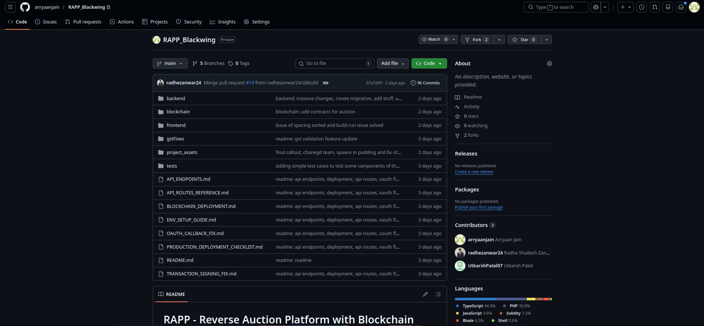

# About the RAPP Backend & Blockchain Infrastructure

RAPP (Reverse Auction Procurement Platform) is a comprehensive B2B enterprise platform that heavily relies on secure backend interactions and verified blockchain smart contracts.

Currently, this public repository **only contains the Frontend (React + TypeScript) codebase**.

## 🌐 Live Application

**Working Link:** [https://rapp.blackwing.tech](https://rapp.blackwing.tech)

## 🔒 Why is the Backend Private?

Due to the nature of enterprise procurement data, cryptographic signing procedures, and proprietary reverse-auction algorithms, the **Backend (Laravel) and Blockchain (Solidity smart contracts)** reside in a separate, completely private repository to protect our Intellectual Property (IP).

Sharing the direct commit history of those components would expose:
1. **Proprietary Algorithms**: Critical logic for our automated reverse auction ranking system.
2. **Database Schemas & Migrations**: Proprietary structuring of enterprise data.
3. **Admin Private Keys & Wallets**: Used for server-side smart contract interactions and gas sponsorship.

## 📸 Private Repository Snapshot

As verified below, the private repository `RAPP_Blackwing` contains the full full-stack history, with **96 commits** encompassing the backend, blockchain, and frontend development starting on **February 21, 2026**.

 

## 🏗️ Architectural Snapshot (How it Works)

Even without access to the code, here is an architectural snapshot of how the backend powers the frontend you see in this repository:

### 1. The Laravel RESTful API
- **Language**: PHP 8.x + Laravel 12.x
- **Responsibilities**:
  - Handles **OAuth flow** with Google and mints secure JWT tokens via Laravel Sanctum.
  - Implements complex queuing systems to automatically compute auction rankings as reverse bids come in.
  - Controls the **In-App Token Wallet Architecture**, interacting with **Razorpay** to process fiat payments and updating user token balances.

### 2. The Smart Contracts (Solidity + Sepolia Testnet)
- **Framework**: Hardhat + Ethers.js
- **Network**: Deployed to the Ethereum Sepolia Testnet.
- **Custom Gasless Architecture**: Instead of using third-party paymasters, **we built our own gasless transaction system**. The backend acts as an omni-relayer, signing and sponsoring all blockchain transactions using a securely managed admin MetaMask wallet.
- **In-App Currency Economics**: Users do not need any cryptocurrency to use the platform. They recharge their "in-app tokens" via fiat payments (**Razorpay**). Every time they perform an on-chain action (like bidding), the backend deducts the appropriate in-app token fee from their wallet and pays the actual Ethereum gas fee on their behalf.
- **Core Contracts**:
  - `RAPPRegistry.sol`: Registers Companies and Vendors on the blockchain with immutable verification.
  - `RAPPAuction.sol`: Handles the live bidding mechanics, storing truncated records of bids, and generating verifiable cryptographic receipts.

### 3. Connection & Verification Flow
When a vendor wants to apply for a private listing, the flow operates across all three systems:
1. **Frontend**: The Vendor inputs the Company's `Share ID` and hits "Request Connection".
2. **Backend**: Laravel verifies the validity of the `Share ID`, checks internal validation (GST verification endpoints), and creates a pending connection constraint.
3. **Smart Contract**: Once the Company approves the request in the Frontend UI, the Backend signs the transaction, sponsors the gas, and records this handshake immutably on the Blockchain. The transaction hash is returned to the Frontend and displayed as a `TxHashBadge`.

---

*If you are an auditor, partner, or potential employer needing access to the private repository and commit history for verification purposes, please contact the repository owner directly.*
